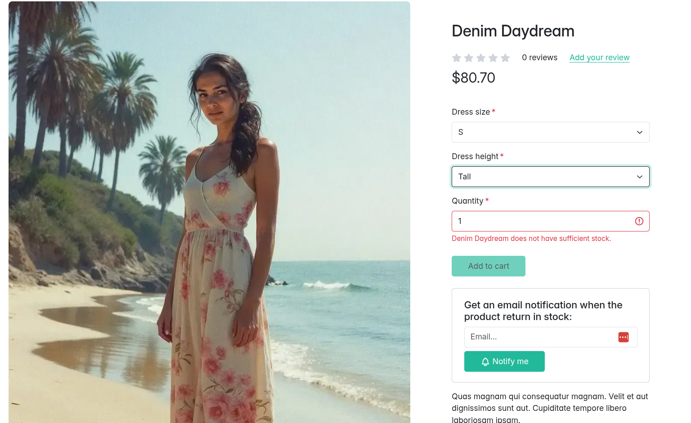
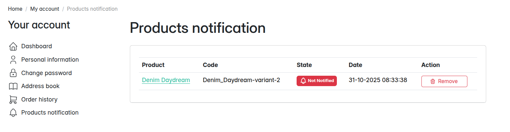
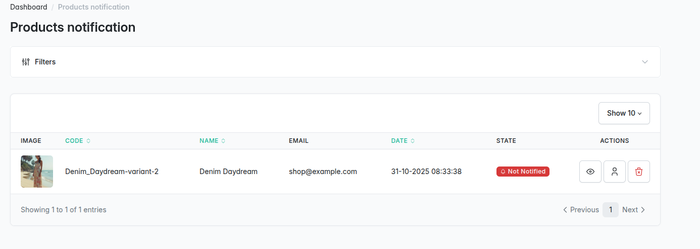

<p align="center">
    <a href="https://sylius.com" target="_blank">
        
    </a>
</p>

<h1 align="center">Back in Stock Notification Plugin</h1>

<p align="center">Plugin that add the possibility to receive an email notification when a product return in stock</p>

<p align="center"><a href="https://github.com/webgriffe/SyliusBackInStockNotificationPlugin/actions"></a></p>

## Features

### Subscribe to get a Notification when a product return in stock



### View your subscriptions in the apposite section of your account



### View your client subscriptions in the apposite admin section



## Requirements

* PHP `^8.2`
* Sylius `^2.0`

## Installation

1. Run `composer require webgriffe/sylius-back-in-stock-notification-plugin --no-scripts`.

2. Add the plugin to the `config/bundles.php` file:

```php
Webgriffe\SyliusBackInStockNotificationPlugin\WebgriffeSyliusBackInStockNotificationPlugin::class => ['all' => true],
```

3. Import the plugin routes by creating a file in `config/routes/webgriffe_sylius_back_in_stock_notification_plugin.yaml` with the follwing content:

```yaml
webgriffe_sylius_back_in_stock_notification_plugin:
  resource: "@WebgriffeSyliusBackInStockNotificationPlugin/config/routing.yaml"
```

4. Import required packages config in your `config/packages/webgriffe_sylius_back_in_stock_notification_plugin.yaml` file:

```yaml
imports:
   - { resource: "@WebgriffeSyliusBackInStockNotificationPlugin/config/packages.yaml" }
```

5. Update the database schema and install assets:

```bash
bin/console doctrine:migrations:migrate
bin/console assets:install
bin/console sylius:theme:assets:install
```

6. Clear cache:

```bash
bin/console cache:clear
```

## Configuration

This module sends mail using a Symfony Command. Unfortunately, the command line context does not know about your VirtualHost or domain name. To fix this, the Command loads the hostname from the Subscription's channel, if nothing set it defaults to `localhost`. In console commands, URLs use http by default. You can change this globally with these configuration parameters:

1. Edit the `config/services.yml` file by adding the following content:

```yaml
parameters:
    router.request_context.scheme: https
```

2. As said early this module provides a command that check the stock of the product. You have to set the command `bin/console webgriffe:back-in-stock-notification:alert` in the crontab, once a day is enough:

```bash
0 12 * * * <absolute-php-path> <absolute-path-to-sylius-dir>/bin/console webgriffe:back-in-stock-notification:alert
```

## Optional Configuration

If you want to use our Behat defined steps you have to include our Behat class in your autoloader-dev. To achieve this adds the following line to your `composer.json`:

```json
"autoload-dev": {
    "psr-4": {
      "Tests\\Webgriffe\\SyliusBackInStockNotificationPlugin\\": "vendor/webgriffe/sylius-back-in-stock-notification-plugin/tests/"
    }
},
```

## Contributing

To contribute to this plugin clone this repository, create a branch for your feature or bugfix, do your changes and then make sure al tests are passing.

```bash
composer install
(cd vendor/sylius/test-application && yarn install)
(cd vendor/sylius/test-application && yarn build)
vendor/bin/console assets:install

docker-compose up -d # only if you haven't mysql and mailhog installed locally 

vendor/bin/console doctrine:database:create
vendor/bin/console doctrine:migrations:migrate -n
# Optionally load data fixtures
vendor/bin/console sylius:fixtures:load -n

symfony server:ca:install
symfony server:start -d
```

### Running plugin tests

#### PHPUnit

```bash
vendor/bin/phpunit
```

#### PHPSpec

```bash
vendor/bin/phpspec run
```

#### Behat (non-JS scenarios)

```bash
vendor/bin/behat --strict --tags="~@javascript"
```

#### Behat (JS scenarios)

1. [Install Symfony CLI command](https://symfony.com/download).
    
2. Start Headless Chrome:

```bash
google-chrome-stable --enable-automation --disable-background-networking --no-default-browser-check --no-first-run --disable-popup-blocking --disable-default-apps --allow-insecure-localhost --disable-translate --disable-extensions --no-sandbox --enable-features=Metal --headless --remote-debugging-port=9222 --window-size=2880,1800 --proxy-server='direct://' --proxy-bypass-list='*' http://127.0.0.1
```

3. Install SSL certificates (only once needed) and run test application's webserver on `127.0.0.1:8080`:

```bash
symfony server:ca:install
APP_ENV=test symfony server:start --port=8080 --dir=tests/Application/public --daemon
```

4. Run Behat:

```bash
vendor/bin/behat --strict --tags="@javascript"
```
  
#### Static Analysis

##### Psalm

```bash
vendor/bin/psalm
```

##### PHPStan

```bash
vendor/bin/phpstan analyse -c phpstan.neon
```

##### Coding Standard

```bash
vendor/bin/ecs check
```

### Opening Sylius with your plugin

- Using `test` environment:

```bash
(cd tests/Application && APP_ENV=test bin/console sylius:fixtures:load)
APP_ENV=test symfony server:start --port=8080 --dir=tests/Application/public --daemon
```

- Using `dev` environment:

```bash
(cd tests/Application && APP_ENV=dev bin/console sylius:fixtures:load)
APP_ENV=dev symfony server:start --dir=tests/Application/public --daemon
```

## License

This plugin is under the MIT license. See the complete license in the LICENSE file.

## Credits

Developed by [Webgriffe®](http://www.webgriffe.com/).
