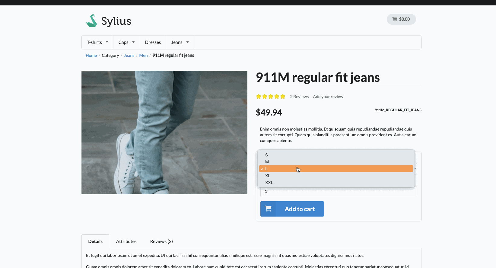
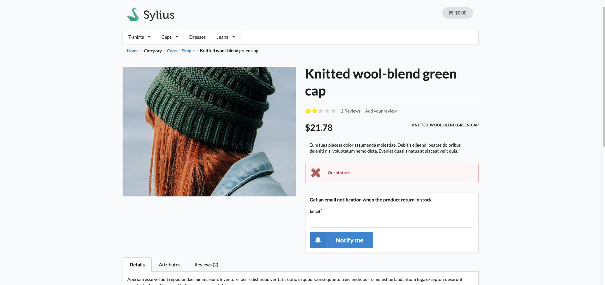
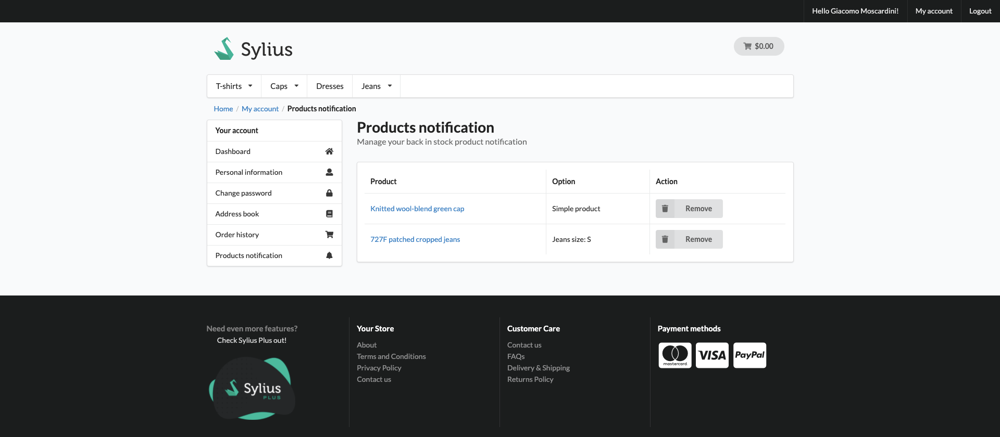
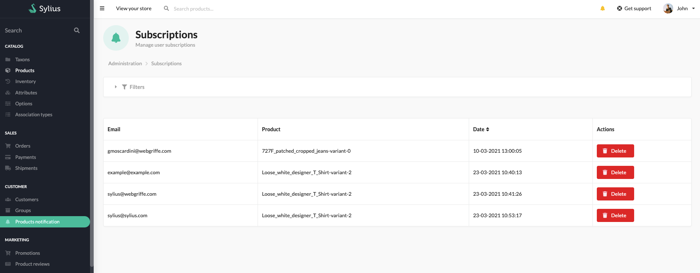

<p align="center">
    <a href="https://sylius.com" target="_blank">
        
    </a>
</p>

<h1 align="center">Back in Stock Notification Plugin</h1>

<p align="center">Plugin that add the possibility to receive an email notification when a product return in stock</p>

<p align="center"><a href="https://github.com/webgriffe/SyliusBackInStockNotificationPlugin/actions"></a></p>

## Features

### Subscribe to get a Notification when a product return in stock





### View your subscriptions in the apposite section of your account



### View your client subscriptions in the apposite admin section



## Requirements

* PHP `^7.3`
* Sylius `^1.8`

## Installation

1. Run `composer require webgriffe/sylius-back-in-stock-notification-plugin`.

2. Add the plugin to the `config/bundles.php` file:

    ```php
    Webgriffe\SyliusBackInStockNotificationPlugin\WebgriffeSyliusBackInStockNotificationPlugin::class => ['all' => true],
    ```
3. Import the plugin routes by creating a file in `config/routes/webgriffe_sylius_back_in_stock_notification_plugin.yaml` with the follwing content:

    ```yaml
    webgriffe_sylius_back_in_stock_notification_plugin:
      resource: "@WebgriffeSyliusBackInStockNotificationPlugin/Resources/config/routing.yaml"
    ```

4. Import required config in your `config/packages/webgriffe_sylius_back_in_stock_notification_plugin.yaml` file:

   ```yaml
   imports:
       - { resource: "@WebgriffeSyliusBackInStockNotificationPlugin/Resources/config/app/config.yaml" }
   ```

5. Finish the installation by updating the database schema and installing assets:

    ```bash
    bin/console doctrine:migrations:diff
    bin/console doctrine:migrations:migrate
    bin/console assets:install
    bin/console sylius:theme:assets:install
    ```

## Configuration

This module send mail using a Symfony Command. Unfortunately, the command line context does not know about your VirtualHost or domain name. To fix this, you need to configure the “request context”, which is a fancy way of saying that you need to configure your environment so that it knows what URL it should use when generating URLs. For further information you can see [Symfony Documentation](https://symfony.com/doc/2.6/cookbook/console/sending_emails.html).

1. Edit the `config/services.yml` file by adding the following content:

```yaml
parameters:
    router.request_context.host: example.org
    router.request_context.scheme: https
```

2. As said early this module provide a command that check the stock of the product. You have to set the command `bin/console webgriffe:back-in-stock-notification:alert` in the crontab, once a day is enough:

```bash
0 12 * * * <absolute-php-path> <absolute-path-to-sylius-dir>/bin/console webgriffe:back-in-stock-notification:alert
```

## Contributing

To contribute to this plugin clone this repository, create a branch for your feature or bugfix, do your changes and then make sure al tests are passing.

    ```bash
    (cd tests/Application && yarn install)
    (cd tests/Application && yarn build)
    (cd tests/Application && APP_ENV=test bin/console assets:install public)

    (cd tests/Application && APP_ENV=test bin/console doctrine:database:create)
    (cd tests/Application && APP_ENV=test bin/console doctrine:schema:create)
    ```

To be able to setup a plugin's database, remember to configure you database credentials in `tests/Application/.env` and `tests/Application/.env.test`.

### Running plugin tests

  - PHPUnit

  ```bash
  vendor/bin/phpunit
  ```

- PHPSpec

  ```bash
  vendor/bin/phpspec run
  ```

- Behat (non-JS scenarios)

  ```bash
  vendor/bin/behat --strict --tags="~@javascript"
  ```

- Behat (JS scenarios)

    1. [Install Symfony CLI command](https://symfony.com/download).

    2. Start Headless Chrome:

        ```bash
        google-chrome-stable --enable-automation --disable-background-networking --no-default-browser-check --no-first-run --disable-popup-blocking --disable-default-apps --allow-insecure-localhost --disable-translate --disable-extensions --no-sandbox --enable-features=Metal --headless --remote-debugging-port=9222 --window-size=2880,1800 --proxy-server='direct://' --proxy-bypass-list='*' http://127.0.0.1
        ```
    3. Install SSL certificates (only once needed) and run test application's webserver on `127.0.0.1:8080`:

        ```bash
        symfony server:ca:install
        APP_ENV=test symfony server:start --port=8080 --dir=tests/Application/public --daemon
        ```

    4. Run Behat:

      ```bash
      vendor/bin/behat --strict --tags="@javascript"
      ```

  - Static Analysis

    - Psalm

      ```bash
      vendor/bin/psalm
      ```

    - PHPStan

      ```bash
      vendor/bin/phpstan analyse -c phpstan.neon -l max src/
      ```

  - Coding Standard

    ```bash
    vendor/bin/ecs check src
    ```

### Opening Sylius with your plugin

- Using `test` environment:

    ```bash
    (cd tests/Application && APP_ENV=test bin/console sylius:fixtures:load)
    (cd tests/Application && APP_ENV=test bin/console server:run -d public)
    ```

- Using `dev` environment:

    ```bash
    (cd tests/Application && APP_ENV=dev bin/console sylius:fixtures:load)
    (cd tests/Application && APP_ENV=dev bin/console server:run -d public)
    ```

## License

This plugin is under the MIT license. See the complete license in the LICENSE file.

## Credits

Developed by [Webgriffe®](http://www.webgriffe.com/).